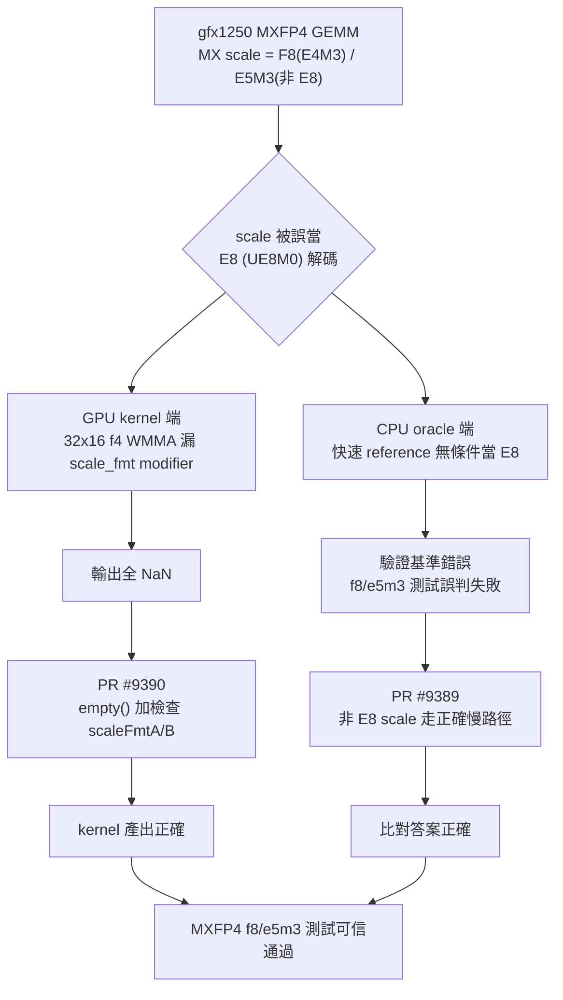

# MXFP4 non-E8 scale 修正比較分析

> 對 [PR #9389](https://github.com/ROCm/rocm-libraries/pull/9389) 與 [PR #9390](https://github.com/ROCm/rocm-libraries/pull/9390) 的比較分析(繁體中文)

[TOC]

---

## 一句話總結

兩個 PR 其實是**同一個病症的兩個不同層面**:在 gfx1250 上跑 MXFP4 GEMM,當 MX scale 不是 E8 (UE8M0) 而是 F8 (E4M3) / E5M3 時,scale 被誤當成 E8 解碼,導致驗證失敗或輸出全 NaN。

差別在於:

- **PR #9389** 修的是 **CPU 驗證參考(測試預言 / oracle)**
- **PR #9390** 修的是 **GPU kernel 的組語產生(codegen)**

---

## 逐一分析

### PR #9389 — `fix(tensilelite): defer non-E8 MX scales to slow reference path`

> 作者:geotseng-amd

- **層面**:CPU 端的測試驗證參考(oracle),`client/src/Reference.cpp`,**不影響 kernel / 產品行為**。
- **Root cause(根因)**:#8106 加入的快速 MXFP4 CPU reference 會**無條件**把 MX scale tensor 當成 E8 (UE8M0) 重新解讀,完全忽略 `DataTypeMXSA/MXSB`。因此當 scale block 是 F8 (E4M3) 或 E5M3 時,scale 被當成「指數」而非浮點值來解碼 → 產出**錯誤的驗證基準**。
  - 結果:E8 scale 的測試會過,但 f8 / e5m3 scale 的 gfx1250 MXFP4 測試會失敗(其實是 oracle 錯,不是 kernel 錯)。
- **Fix(修法)**:新增 `isFastPathEligible()` 守門判斷,把**非 E8 的 MX scale** 導回較慢但正確的 `columnMajorGemm` 路徑;該路徑會用 `mxScaleElementAsFloat()` 逐一正確解碼每個 scale。

### PR #9390 — `fix(stinkytofu): keep scale-format modifier on MX f4 WMMA to fix MI32x16`

> 作者:mengzcai

- **層面**:GPU kernel 的實際 codegen,在 StinkyTofu(`ir/asm/StinkyModifiers.hpp`),**會影響實際產生的組語**。
- **Root cause(根因)**:32x16 的 f4 kernel(`v_wmma_scale_f32_32x16x128_f4`)最終組語**漏掉了** `matrix_a_scale_fmt` / `matrix_b_scale_fmt`,硬體因此把 F8 (E4M3) scale 當成預設 E8 (UE8M0) 解碼 → 輸出**全 NaN**。
  - 注意:rocisa 本身產生正確(有 `matrix_a_scale_fmt:2`)。問題發生在 rocisa → StinkyTofu 轉換時,`handleMXMFMAModifiers` 只有在 `!fmts.empty()` 才掛上 `MatrixFmtModifiers`。
  - 而 `MatrixFmtModifiers::empty()` **只檢查輸入矩陣格式欄位** `fmtA` / `fmtB`(來自 `matrix_a_fmt` / `matrix_b_fmt`),**忽略了 scale 格式欄位** `scaleFmtA` / `scaleFmtB`。

  兩種低精度 WMMA 行為不同:

  | WMMA | 輸入格式欄位 | `empty()` 判定 | 結果 |
  |---|---|---|---|
  | 通用 `f8f6f4`(16x16) | `matrix_a_fmt` 有值(選 FP8/FP6/FP4),`fmtA` 有值 | false → modifier 保留 | 正常 |
  | 專用 `f4`(32x16) | FP4 為 opcode 內建,不發 `matrix_a_fmt`(`fmtA`/`fmtB` 維持 NONE),只設 scale 格式 | 誤判為 true(空)→ modifier 被丟 | NaN |

- **Fix(修法)**:讓 `MatrixFmtModifiers::empty()` **同時檢查** `scaleFmtA` / `scaleFmtB`,這樣只設了 scale 格式的 f4 opcode 就不會被誤判為空,modifier(連同 scale_fmt)得以保留。

---

## 對照表

| 面向 | PR #9389 | PR #9390 |
|---|---|---|
| 修改層面 | CPU 驗證參考(test oracle) | GPU kernel codegen(StinkyTofu) |
| 檔案 | `client/src/Reference.cpp` | `ir/asm/StinkyModifiers.hpp` |
| 症狀 | f8 / e5m3 scale 測試失敗(誤判) | 輸出全 NaN |
| 根因 | 快速 reference 無條件把 scale 當 E8 | `empty()` 沒檢查 scale 格式欄位,導致 scale_fmt modifier 被丟掉 |
| 誰錯了 | 驗證基準(oracle)錯 | 實際 kernel 組語錯 |
| 修法 | 非 E8 scale 改走正確的慢路徑 | `empty()` 加入 `scaleFmtA/B` 檢查 |
| 影響 | 僅測試,無產品行為改變 | 影響實際產生的 kernel |
| 適用範圍 | gfx1250 | gfx1250(僅此情況 reject/修正) |

---

## 病症與修正關係圖

---

## 綜合觀察

- **共同主題**:非 E8 的 MX scale(E4M3 / E5M3)在 gfx1250 MXFP4 路徑上被錯誤地以 E8 解讀。
- **互補關係**:#9390 修正「kernel 產出錯誤(NaN)」,#9389 修正「驗證基準本身錯誤」。若只修其中一個,另一個仍可能讓 MXFP4 f8/e5m3 測試無法可信地通過——**一個保證 kernel 對,一個保證拿來比對的答案對**。
- **測試策略差異**:兩個 PR 都被 PR bot 要求補單元測試。
  - #9390 依 reviewer 建議補了 MI32x16(`wmma_f4`)的測試(FileCheck / mxf4 測試)。
  - #9389 的程式碼變更則靠 silicon 上的 tox 全數通過來佐證。
