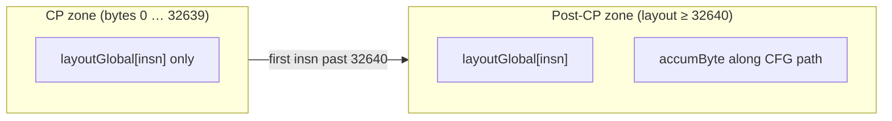
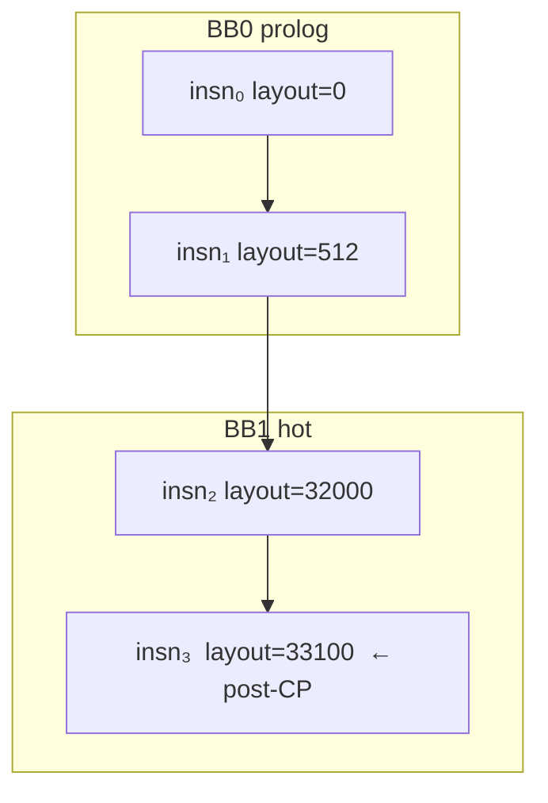
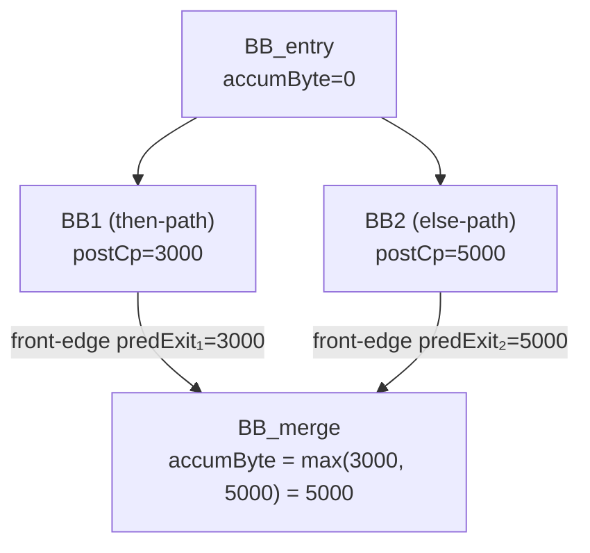
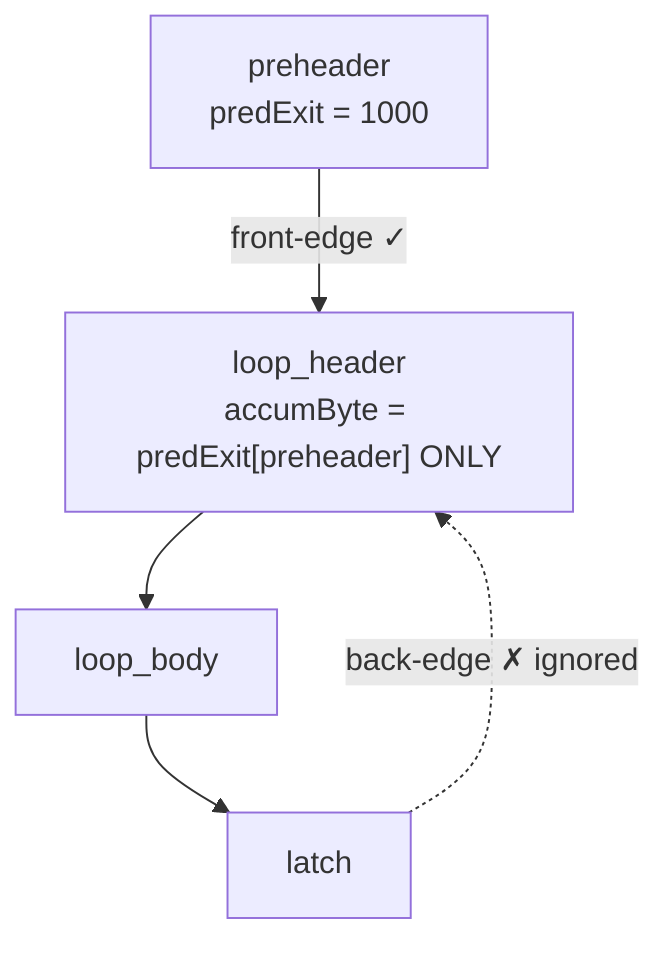
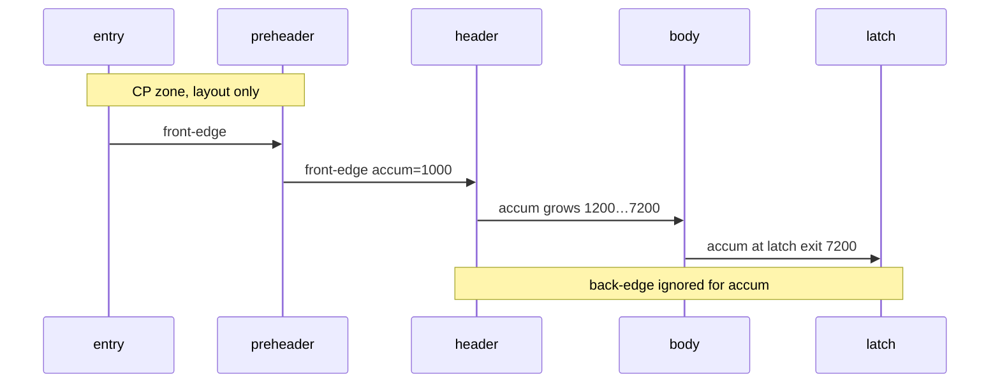
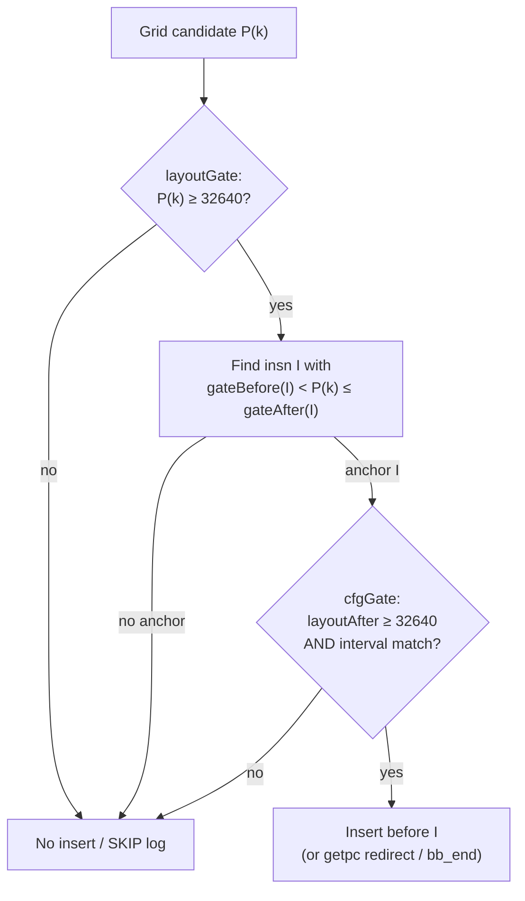
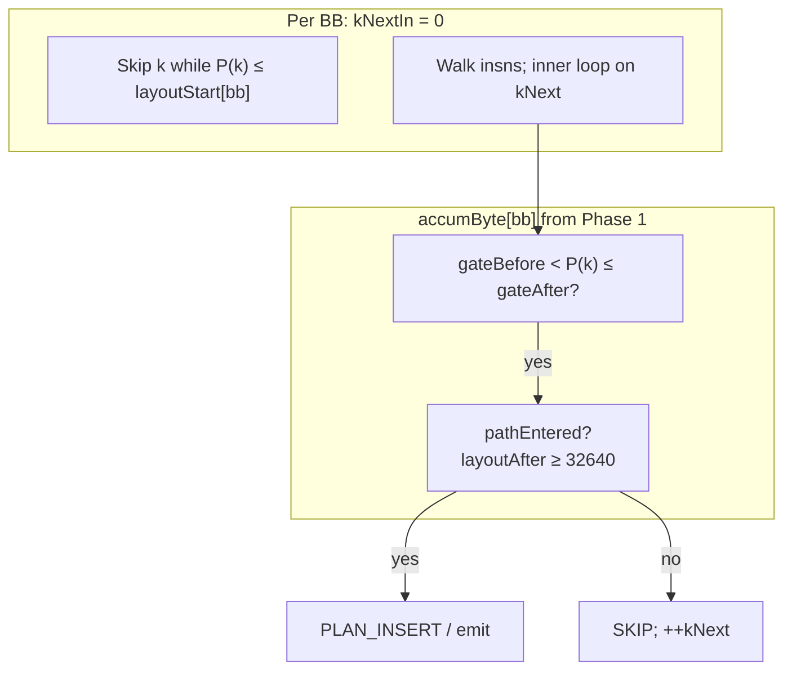
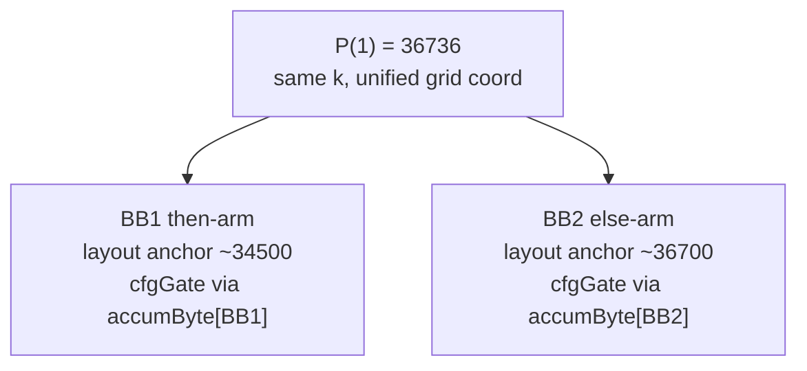
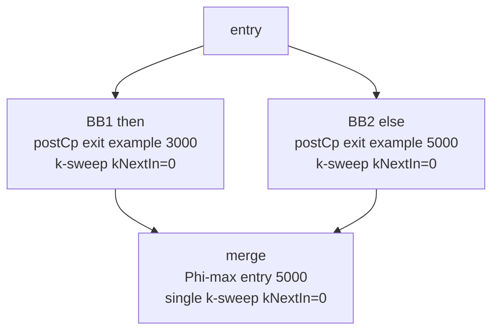

# SwInstructionPrefetchRelDynamicPass — design (Gfx1250)

**Status:** Phase 1 accumulate + insert-site preview + **Phase 2 CFG-gated IR insert** implemented. Gfx1250 pipeline runs **dynamic only** when `EnableSwInstructionPrefetchRelStatic` is true (static pass commented out). Pipeline mutual-exclusion cleanup (P4) remains optional. See §9.

**Proposal (§15 — default in Gfx1250):** Per-BB anchor grid `P_bb(localK) = A(bb) + localK×4096` via `insertSwPrefetchLabelsDynamicPerBbAnchor`; Phase 1 debug preview matches when `computeSwPrefetchRelPhase1Accum(..., phase2UsesPerBbAnchorGrid=true)` (dynamic pass default). Global `32640 + k×4096` remains available via `createSwInstructionPrefetchRelDynamicPass(..., /*usePerBbAnchorPrefetchGrid=*/false)`.

**Related:**

- [StinkyTofu-Prefetch-Passes-Report.md](StinkyTofu-Prefetch-Passes-Report.md) — PC-rel grid, sizing, pipeline
- [SwPrefetchAbs-TwoPass-Plan.md](SwPrefetchAbs-TwoPass-Plan.md) — parallel **abs** static/dynamic split (same size gates)
- `SwInstructionPrefetchRelStaticPass.{hpp,cpp}` — reference implementation for grid walk + insertion

---

## Summary

Add **`SwInstructionPrefetchRelDynamicPass`**, a CFG-aware PC-rel software prefetch pass. It refines the existing **`SwInstructionPrefetchRelStaticPass`**, which handles kernels using **linear layout only** (no CFG gate).

|                        | **Static pass**                               | **Dynamic pass (implemented)**                                                                                                                                       |
| ---------------------- | --------------------------------------------------- | -------------------------------------------------------------------------------------------------------------------------------------------------------------------------- |
| **Pass**         | `SwInstructionPrefetchRelStaticPass`              | `SwInstructionPrefetchRelDynamicPass`                                                                                                                                    |
| **Pass gate**    | None (always walks BBs when pass runs)              | **`totalLayoutBytes <= 32640` → no-op** (Phase 2 skipped)                                                                                                         |
| **When insert**  | Layout anchor`layoutBefore < P(k) ≤ layoutAfter` | Same opcode + grid;**dual gate** (layout + CFG accum)                                                                                                                |
| **CFG model**    | Sequential function BB order                        | **CFG traversal** + Phi-max at **front-edge** merges only                                                                                                      |
| **Insertion**    | `s_prefetch_inst_pc_rel 0, null, 31` at `P(k)`  | **Default:** `insertSwPrefetchLabelsDynamicPerBbAnchor` (`walkSwPrefetchRelGridInBlockPerBbAnchor`). **Optional:** global `walkSwPrefetchRelGridInBlock` |
| **Scratch SGPR** | None                                                | None                                                                                                                                                                       |

**Today (Gfx1250 pipeline):** When enabled, **`SwInstructionPrefetchRelDynamicPass`** performs real inserts. Static pass remains available via `stinkytofu-opt` / unit tests but is **not** registered in `Gfx1250Backend.cpp` (avoid double-insert).

**Two internal phases (dynamic pass):**

1. **Phase 1 — accumulate (no IR change):** Walk every BB in function order → `layoutGlobal`, `blockLocalBytes`, `blockLocalBytesPostCp`. Then one CFG RPO pass → `accumByte` / `accumExit` (Phi-max on **front edges**; back-edges excluded). When debug is on, also runs a **dry-run grid walk** that logs `PLAN_INSERT` / `SKIP`: **per-BB anchor** preview when `phase2UsesPerBbAnchorGrid` is true (pass default), else global `debugPlanInsertSitesInBlock` → `walkSwPrefetchRelGridInBlock`.
2. **Phase 2 — insert (implemented):** If `totalLayoutBytes > 32640`, for each BB in function order: **default** `insertSwPrefetchLabelsDynamicPerBbAnchor` (per-BB `A(bb)` grid); optional `insertSwPrefetchLabelsDynamic` (global `P(k)`), then `accumulateInstructionSize` on final IR (mirrors static pass `m_byteOffsetBase` handoff).

**Pass no-op vs per-site gate:** `totalLayoutBytes <= P(0)` skips **all** Phase 2 insertion even if Phase 1 preview would `PLAN_INSERT` at `P(0)` inside a straddling insn (e.g. kernel ending exactly at byte 32640). Static pass has no equivalent global gate.

**Grid (unchanged):**

```text
P(k) = 128×255 + k×(32×128) = 32640 + k×4096
```

| Byte range           | Who prefetches                                              |
| -------------------- | ----------------------------------------------------------- |
| **0 … 32639** | CP / shader preload only —**no** software prefetch   |
| **≥ P(0)**    | Software PC-rel at each`P(k)` while `P(k) < totalBytes` |

---

## 0. Problem and motivation

### 0.1 What the static pass does today

`SwInstructionPrefetchRelStaticPass` walks basic blocks in **function list order**, maintaining a running `**m_byteOffsetBase`** (linear layout offset). For each BB it:

1. Calls `**insertSwPrefetchLabels`** — forward IR walk, inserts `**s_prefetch_inst_pc_rel`** when `globalPcBefore < P(k) ≤ globalPcAfter`.
2. Calls `**accumulateInstructionSize`** — same byte rules, updates totals and label map.

This works when the kernel fits a **~64 KiB I-cache** window and CFG is effectively “run once through prolog → hot path.”

### 0.2 Why a dynamic pass is needed

When `**totalInstBytes > 65536`**, execution **streams** through the image; I-cache **replacement** matters. The static pass still places prefetches at correct **physical** byte offsets, but:

| Gap                                          | Impact                                                                                                                                                                        |
| -------------------------------------------- | ----------------------------------------------------------------------------------------------------------------------------------------------------------------------------- |
| **Linear BB order ≠ execution order** | Diamond / loop merge BBs may be reached after different dynamic byte distances.                                                                                               |
| **Per-BB `kNext` restarts at 0**     | Each BB skips`P ≤ blockGlobalByteOffset`; works for linear layout but does not model path-sensitive “how far have we executed?”                                          |
| **Cross-BB handoff TODOs**             | Source comments: tail flush vs next-BB, last-BB handling — dynamic pass is the right home.                                                                                   |
| **Loop back-edges**                    | 2nd+ iteration: loop body already touched I-cache —**do not** fold latch into header Phi (duplicate SW prefetch). Use **front-edge only** (preheader → header). |

The dynamic pass does **not** change the prefetch **opcode** or **grid**; it changes **how per-BB global state is computed** before insertion.

### 0.3 Relationship to abs prefetch

[SwPrefetchAbsInsertionPass-Design.md](SwPrefetchAbsInsertionPass-Design.md) proposes `**s_prefetch_inst`** (getpc + label base) with **site** earlier than **target** for issue-latency hiding. That is a **separate** track (scratch SGPR, burst bundles).

**This document** stays on the **PC-rel** path (`s_prefetch_inst_pc_rel`, no scratch SGPR). Size gates and static/dynamic **split** mirror the abs two-pass plan for consistency.

---

## 1. Vocabulary

| Term                                   | Meaning                                                                                                                |
| -------------------------------------- | ---------------------------------------------------------------------------------------------------------------------- |
| **P(k)**                         | Global byte offset in linked kernel image:`32640 + k×4096`                                                          |
| `**layoutGlobal[insn]`**             | Linear emitted offset from kernel start:`layoutStart[bb] + blockLocalOffset`                                         |
| `**layoutStart[bb]`**                | Global offset of BB’s first byte in function list order (`m_byteOffsetBase` at BB entry)                            |
| `**blockLocalBytes[bb]`**            | Sum of encoded instruction bytes inside the BB (dry walk)                                                              |
| `**accumByte[bb]`**                  | CFG bytes consumed along a path**from the first layout position past 32640** (§2.2); merge = Phi-**max**  |
| `**predExit`**                       | `accumByte[pred] + blockLocalBytesPostCp[pred]` — bytes accumulated on exit from predecessor along that path        |
| `**blockLocalBytesPostCp[pred]`**    | Portion of`blockLocalBytes[pred]` that lies **after** layout offset 32640 (0 if BB entirely below CP zone)     |
| **Anchor (static)**              | Instruction where layout spans`P(k)` (`layoutBefore < P(k) ≤ layoutAfter`)                                        |
| **Anchor (dynamic)**             | Instruction where**hybrid gate interval** contains `P(k)` (`gateBefore < P(k) ≤ gateAfter`; §2.3)          |
| `**layoutBefore` / `layoutAfter`** | Per-instruction layout span in global bytes (`layoutBefore + instBytes = layoutAfter`)                               |
| `**gateBefore` / `gateAfter`**     | Hybrid anchor interval used for`cfgGate` (layout span until first post-CP byte in BB, then CFG accum span)           |
| `**accumBeforeGlobal(I)`**           | `32640 + bbEntryAccum + postCpCumul_before(I)` — pure CFG path progress (debug; not always equal to `gateBefore`) |
| `**accumAfterGlobal(I)`**            | `32640 + bbEntryAccum + postCpCumul_after(I)` — pure CFG path progress (debug; not always equal to `gateAfter`)   |
| **Phi-max (front-edge)**         | `accumByte[bb] = max over **front-edge** preds of predExit`; back-edges **excluded**                           |
| **Front-edge**                   | CFG predecessor that is**not** a detected back-edge (`latch → header`)                                        |
| **Dry walk**                     | `insertSwPrefetchLabels(..., allowSwPrefetchInsertion=false)` — same sizing, no IR mutation                         |

### 1.1 What `totalBytes` means in `insertSwPrefetchLabels`

Inside the per-BB walk, `**totalBytes` is block-local** (starts at 0 each BB). It becomes **global** only when combined with the caller’s `**blockGlobalByteOffset`**:

```text
layoutGlobalBefore = blockGlobalByteOffset + totalBytes   // start of current insn
layoutGlobalAfter  = layoutGlobalBefore + instBytes
```

The static pass sets `blockGlobalByteOffset = m_byteOffsetBase`, which is the **sum of all prior BB sizes in function order** — so layout offsets are **global across basic blocks**, not isolated per BB.

`insertSwPrefetchLabels` compares grid boundaries against this **global layout** position. It does **not** know CFG execution paths; that is what the dynamic pass adds.

### 1.2 What `accumByte[pred] + blockLocalBytes[pred]` means

This is the standard CFG dataflow “exit value from predecessor”:

```text
predExit = accumByte at end of pred block
         = accumByte[pred] + (bytes accumulated inside pred along this path)
```

- `**accumByte[pred]**` — how many post-CP execution bytes you have already consumed **when you enter** predecessor `pred` (along this path).
- `**+ blockLocalBytesPostCp[pred]`** — add the portion of `pred`’s instructions that lie **past layout 32640**.

At a merge BB with two **front-edge** predecessors (e.g. diamond):

```text
accumByte[merge] = max(predExit_BB1, predExit_BB2)   // Phi-max, front edges only
```

**Phi-max purpose:** Ensure **all forward control-flow paths** into a merge are covered by software prefetch analysis — take the path that has progressed the **most** in post-CP bytes among **forward** preds.

**Back-edges excluded:** At `loop_header`, the latch predecessor is a **back-edge** — **ignore** it. Reason: on 2nd+ iterations the unrolled / loop-body instructions are **already in I-cache**; counting latch `predExit` would inflate `accumByte`, cause **duplicate** `s_prefetch_inst_pc_rel` coverage, and make body accum **grow without bound** through fixpoint. See §1.3 D–F.

```text
Diamond (function order: BB0, BB1, BB2, BB3):

  BB0 (entry)
   / \
 BB1   BB2
   \ /
   BB3 (merge)

layoutStart[BB3] = size(BB0)+size(BB1)+size(BB2)     // physical emission order
accumByte[BB3]   = max(exit(BB1), exit(BB2))         // CFG Phi-max (execution progress)
```

### 1.3 Diagrams (overview)

#### A. Kernel image: CP zone vs post-CP zone

```text
linked .text (layoutGlobal grows left → right)

|←——— CP zone 0 … 32639 ———→|←—— post-CP: layout ≥ 32640 ——→|
|  layout map ONLY           |  layout map + CFG accumByte   |
|  no CFG accum              |  no insert below P(0)         |
|  no s_prefetch             |  insert at P(k) if dual gate  |
                              ^
                              P(0) = 32640
```



**Yes — `accumByte` exists only in the post-CP zone.** Below layout 32640 we never update `accumByte`. At and above 32640 we update it along execution paths (Phi-max at merges). Insertion at `P(k)` uses **both** `layoutGlobal` (anchor) and `accumByte` (path gate).

#### B. `layoutGlobal` — one offset per instruction

Phase 1 builds a map from each **real instruction** (PHI/LABEL skipped for sizing keys; labels still get offsets) to a **single global layout byte** — the address of that instruction’s first byte in the linked kernel image.

```text
layoutGlobal : Instruction* → int64_t     // one global offset per insn

Example:
  layoutGlobal[insn_prolog_3]  = 12000
  layoutGlobal[insn_hot_0]     = 33100   // past 32640 → also tracked in CFG accum
```

Implementation: `unordered_map<StinkyInstruction*, int64_t>` or parallel array keyed by walk order. **Not** per-BB — **global** across all basic blocks (function list order + `layoutStart[bb]`).



#### C. CFG dataflow: diamond merge (front-edge Phi-max)

Both predecessors are **forward** edges — use `**max`** for best forward-path coverage.



```text
predExit[pred] = accumByte[pred] + blockLocalBytesPostCp[pred]

Single front pred:  accumByte[succ] = predExit[pred]
Multi front pred:   accumByte[merge] = max(predExit[pred_i])   // Phi-max

frontPreds(bb) = preds(bb) minus back-edges from detectLoops
```

`blockLocalBytesPostCp[pred]` = 0 if entire BB lies in CP zone (layout < 32640).

**Why max here:** Two forward paths may reach the same merge with different post-CP progress — take the **larger** so prefetch analysis covers the path that still needs the **most** fetch-ahead. This is **not** the loop latch case (§1.3 D).

#### D. Loop: front-edge only (back-edge excluded)

Software prefetch helps **first fetch** into post-CP code. After one loop iteration, body insns are typically **already cached** — the latch back-edge must **not** contribute to `accumByte` at the header.



```text
frontPreds(header) = { preheader }        // latch → header is back-edge
accumByte[header]  = predExit[preheader]  // NOT max(pre, latch)
```

| Edge                | Used in accum? | Why                                                    |
| ------------------- | -------------- | ------------------------------------------------------ |
| preheader → header | **yes**  | First time entering loop; need SW prefetch             |
| latch → header     | **no**   | 2nd+ iter: body already in I-cache; duplicate coverage |

**Unrolled loops:** Compiler unrolling removes the back-edge (linear BB chain). Front-edge-only analysis matches layout walk — no special case needed.

#### F. Loop case (detailed) — front-edge only

**Example layout** (same numbers as prior walkthrough):

| Block       | `layoutStart` | `blockLocalBytesPostCp` |
| ----------- | --------------- | ------------------------- |
| entry       | 0               | 0                         |
| preheader   | 30000           | 1000 (crosses 32640)      |
| loop_header | 34000           | 200                       |
| loop_body   | 34200           | 6000                      |
| latch       | 40200           | 500                       |

**Single RPO pass (no fixpoint):**

```text
accumByte[entry]     = 0
accumByte[preheader] = 0 + 0 = 0        // entry has postCp=0
predExit[preheader]  = 0 + 1000 = 1000

// header: only front-edge pred = preheader
accumByte[header]    = 1000               // NOT max(1000, latchExit)

accumByte[body]      = 1000 + 200 = 1200
accumByte[latch]     = 1200 + 6000 = 7200
// latch → header back-edge: NOT fed back into header
```

`**accumByte` does not grow** on repeated virtual iterations — stable after one forward CFG walk.



**Prefetch at `P(1)=36736` in body:**

| Check                  | 1st hardware iteration                      | Why                    |
| ---------------------- | ------------------------------------------- | ---------------------- |
| Layout anchor          | yes                                         | body layout past 32640 |
| CFG accum (front-edge) | yes when path from preheader has progressed | no latch inflation     |

**Contrast — wrong model (latch in Phi-max):**

```text
accumByte[header] = max(1000, 7200) = 7200   // BAD for SW prefetch
→ treats body as if never cached
→ duplicate hints every conceptual lap
→ fixpoint keeps growing body accum
```

#### E. Dual gate at `P(k)` (hybrid anchor)



| Check                | Question                                                                                      |
| -------------------- | --------------------------------------------------------------------------------------------- |
| **layoutGate** | Is`P(k)` in the software-prefetch zone? (`P(k) ≥ 32640` only)                            |
| **cfgGate**    | Does insn`I` own `P(k)` on this path? (`gateBefore < P ≤ gateAfter` + `pathEntered`) |

**Hybrid gate:** while `postCpCumul_before == 0` in the BB, `gateBefore`/`gateAfter` are the **layout** span (static-compatible for `P(0)`). After post-CP bytes accumulate in the BB, `gate`* switch to **CFG** coordinates (`32640 + bbEntryAccum + postCpCumul`).

---

## 2. Dual-offset model (option C — refined)

Physical prefetch targets must sit at **fixed layout addresses** in linked `.text`. Whether a prefetch **should fire on a given path** depends on **CFG execution progress** past the CP zone.

### 2.1 Region 0…32639 — layout only

| Action                | Detail                                                                                                                                     |
| --------------------- | ------------------------------------------------------------------------------------------------------------------------------------------ |
| Walk all instructions | Record`**layoutGlobal[insn]`** → one **global** layout byte per instruction (hash map / `Instruction* → int64_t`; see §1.3 B) |
| CFG`accumByte`      | **Not tracked, not updated** — stays undefined / zero for gating purposes                                                           |
| Insert                | **Never** — no `s_prefetch_inst_pc_rel` below `P(0)`                                                                            |

**Rule:** Every instruction gets `layoutGlobal`. **Post-CP byte counting** (`postCpInsn`, `blockLocalBytesPostCp`) uses `postCpBytesForInstructionSpan` — bytes **strictly past** 32640 (`0` when `layoutAfter == 32640`). CFG `accumByte` at BB entry is path progress from predecessors; within a BB, running `postCpCumul` tracks local post-CP bytes.

### 2.2 Region ≥ 32640 — layout + CFG accum

From the **first instruction whose `layoutGlobal` exceeds 32640**, start CFG accumulation along each execution path:

```text
accumByte[entry] = 0

// Per instruction in BB (walkBlockLayoutAndPostCp + running postCpCumul):
layoutGlobal[insn] = layoutBefore
postCpInsn = postCpBytesForInstructionSpan(layoutBefore, instBytes)
  // 0 if layoutAfter <= 32640
  // layoutAfter - 32640 if straddling
  // instBytes if layoutBefore >= 32640

blockLocalBytesPostCp[bb] = sum(postCpInsn)
```

**Per-BB CFG pass:** propagate with `predExit` / front-edge Phi-max (§1.2, §1.3 C–F). Only `**blockLocalBytesPostCp`** contributes to `predExit`.

At CFG merges: `**accumByte[bb] = max(predExit[pred])`** over **front-edge** predecessors only (back-edges from `detectLoops` excluded).

### 2.3 Insertion gate (phase 2) — layout threshold + CFG anchor

Insert `s_prefetch_inst_pc_rel` at grid boundary `**P(k)`** only when **both** hold:

| #                         | Condition                                                                                  | Role                                                                                                                         |
| ------------------------- | ------------------------------------------------------------------------------------------ | ---------------------------------------------------------------------------------------------------------------------------- |
| **1 — layoutGate** | `P(k) ≥ 32640` (`P(0)`)                                                               | Target is in the software-prefetch zone (not CP preload only).**Does not** use `layoutBefore < P(k) ≤ layoutAfter`. |
| **2 — cfgGate**    | Path entered post-CP**and** `P(k)` falls in the anchor insn’s CFG global interval | **CFG picks the anchor** and decides if this path has executed up to `P(k)`.                                         |

#### Per-instruction coordinates

`accumByte` / `accumExit` are **post-CP path bytes** (0 at entry). `postCpInsn` = bytes **strictly past** 32640 in layout (`0` when `layoutAfter == 32640`). `pathEntered` uses `insnSpanEndsOnOrPastCpBoundary` (`layoutAfter >= 32640`), separate from accum counting.

**Anchor interval** (same test as static `layoutBefore < P(k) ≤ layoutAfter`, hybrid bounds):

Implemented in `cfgGateIntervalBounds` (`postCpCumulBefore` is the selector):

```text
postCpCumul_before == 0   // no post-CP bytes accumulated yet in this BB
  gateBefore = layoutBefore(I)
  gateAfter  = layoutAfter(I)     // static-compatible through first-touch insn

postCpCumul_before > 0    // BB has already counted post-CP layout bytes
  gateBefore = 32640 + bbEntryAccum + postCpCumul_before
  gateAfter  = 32640 + bbEntryAccum + postCpCumul_after
```

Debug per instruction shows **both**:

- `accumBeforeGlobal` / `accumAfterGlobal` — pure CFG path (`32640 + bbEntryAccum + postCpCumul`)
- `gateBefore` / `gateAfter` — hybrid anchor interval used for `P(k)` matching

#### cfgGate (all required)

```text
pathEntered = insnSpanEndsOnOrPastCpBoundary(I)   // layoutAfter >= 32640 (layout-based, not accum-based)

cfgInterval = gateBefore < P(k) ≤ gateAfter       // open left, closed right

cfgGate = pathEntered && cfgInterval              // cfgGateQualifies()
```

**Tail (`bb_end_append`):** `pathEntered = (bbEntryAccum + postCpCumul_exit) > 0`; `cfgGate` additionally requires `accumAfterGlobal_exit < P(k) ≤ blockEndGlobal` (layout tail interval past CFG progress).

#### Anchor selection (dynamic — not layout span)

For each grid candidate `P(k)` with `layoutGate`:

1. Walk instructions in BB program order (per-BB `kNextIn = 0` — §4.3).
2. Find instruction `I` where `cfgInterval` holds.
3. If `layoutGate && cfgGate && allowIns` → emit `s_prefetch_inst_pc_rel` before `I` (or getpc redirect / `bb_end_append` per static rules).

```text
        CP zone                    software prefetch zone
|-------- 0 … 32639 --------|-------- P(k) ≥ 32640 --------|
                             P(0)=32640
                             CFG accumByte starts at entry (0)

Insert at P(k) iff:
  P(k) ≥ 32640                         // layoutGate
  AND pathEntered at anchor I
  AND gateBefore(I) < P(k) ≤ gateAfter(I)   // cfgGate — hybrid interval, not raw layout span alone
```

**Layout** answers: “Is this grid index in the post-CP prefetch zone?”
**Hybrid gate** answers: “Which instruction owns this `P(k)` on this path?” — layout span for pre-accum insns in the BB, then CFG accum span once `postCpCumul_before > 0`.

`accumBeforeGlobal` / `accumAfterGlobal` are **debug coordinates** (pure CFG path). `layoutBefore` / `layoutAfter` are **debug coordinates** (physical layout). Only `gateBefore` / `gateAfter` gate `cfgGate`.

**Do not** use raw `accumByte` as `blockGlobalByteOffset` in `insertSwPrefetchLabels` — physical insert offsets stay in **layout** space; gating uses **CFG global** coordinates (`32640 + accumExit`).

### 2.4 Contrast with static pass today

|                 | Static (today)                         | Dynamic (implemented preview)                                           |
| --------------- | -------------------------------------- | ----------------------------------------------------------------------- |
| Gate            | `layoutBefore < P(k) ≤ layoutAfter` | `P(k) ≥ 32640` + **hybrid** `gateBefore < P(k) ≤ gateAfter` |
| Anchor interval | Layout span only                       | Layout span while`postCpCumul_before==0`; then CFG accum span         |
| `pathEntered` | N/A                                    | `layoutAfter >= 32640` (`insnSpanEndsOnOrPastCpBoundary`)           |
| CFG             | Ignored                                | Front-edge Phi-max; no latch back-edge                                  |
| Loop 2nd+ iter  | N/A                                    | Back-edge ignored — body assumed cached                                |

### 2.5 Edge cases (CFG anchor + `accumBeforeGlobal` / `accumAfterGlobal`)

| Case                                           | Behavior                                                                                                                                             | Verified                                                                                                            |
| ---------------------------------------------- | ---------------------------------------------------------------------------------------------------------------------------------------------------- | ------------------------------------------------------------------------------------------------------------------- |
| **P(k) < 32640**                         | `layoutGate` false — never insert                                                                                                                 | `k ≥ 0` ⇒ `P(k) ≥ 32640` by grid definition                                                                  |
| **CP zone debug**                        | `accumBeforeGlobal=layoutGlobal` (not pinned 32640) until first touch                                                                              | `cfgGateIntervalBounds`                                                                                           |
| **First touch insn, `postCpInsn > 0`** | `pathEntered` true; interval uses **layout** span                                                                                            | `32636 < P(0) ≤ 32648` like static                                                                               |
| `**P(0)=32640` straddle**                    | `layoutGlobal=32636`, `postCpInsn=8` (partial) → `PLAN_INSERT`                                                                                | Same anchor as static                                                                                               |
| `**layoutAfter == 32640` exactly**           | `postCpInsn=0`, `pathEntered` via ends-on-boundary; layout gate → `PLAN_INSERT`                                                               | No sentinel +1 in accum                                                                                             |
| **Insert walk inner loop**               | `P > gateAfter` → `break` (next insn); `P < gateBefore` → `++kNext` (next k); `P == gateBefore` → evaluate → `cfgGate` false → SKIP | `debugPlanInsertSitesInBlock`; do **not** use `P <= gateBefore break` (defers k; commented out in source) |
| **Post-touch insn**                      | interval uses`32640 + accumExit` (e.g. `[32648,32660]`)                                                                                          | Interior grid points                                                                                                |
| **Junction `P == layoutAfter(i)`**     | Only insn**i** (`layoutBefore < P`); next insn starts at `P`                                                                               | Strict`<` on left                                                                                                 |
| **Interval width = `postCpInsn`**      | Grid step 4096 B; per-insn interval 4–8 B                                                                                                           | At most one insn anchors each`P(k)` per BB                                                                        |
| `**layoutGlobal` vs `accumAfterGlobal**`   | May diverge —**expected**; only CFG gates                                                                                                     | Emission order ≠ path progress                                                                                     |
| **BB boundary**                          | Last insn`accumAfterGlobal` = next BB first `accumBeforeGlobal` (single pred)                                                                    | `accumByte[bb]` = `predExit`                                                                                    |
| **Diamond merge**                        | One`accumByte[merge]` = Phi-max                                                                                                                    | Short paths may still prefetch (by design)                                                                          |
| **Same k, multiple BBs**                 | Per-BB`kNextIn=0`; each arm BB may `PLAN_INSERT` for same `k` at different layout anchors                                                      | §4.6; not blocked by global k handoff                                                                              |
| **Loop header**                          | `accumByte` from preheader only; latch excluded                                                                                                    | No latch inflation                                                                                                  |
| **Unreachable BB**                       | `accumByte=0`, `pathEntered` false                                                                                                               | Init all BBs before RPO                                                                                             |
| **getpc window**                         | `insertPoint=before_getpc_redirect`; CFG interval at anchor insn                                                                                   | Same redirect as static                                                                                             |
| `**bb_end_append`**                          | Tail`P(k)` without insn interval: `pathEntered` at exit + layout `blockEndGlobal` bound                                                        | Mirrors static tail flush                                                                                           |
| **Straddle CP insn**                     | `postCpInsn` = `layoutAfter - 32640` (partial); `layoutAfter==32640` → 0                                                                      | `postCpBytesForInstructionSpan`                                                                                   |

### 2.6 Code ↔ behavior (source of truth)

| Function                                     | File                                        | Role                                              |
| -------------------------------------------- | ------------------------------------------- | ------------------------------------------------- |
| `postCpBytesForInstructionSpan`            | `SwPrefetchRelCommon.cpp`                 | Strict past-32640 bytes for accum                 |
| `insnSpanEndsOnOrPastCpBoundary`           | `SwPrefetchRelCommon.cpp`                 | `pathEntered` predicate                         |
| `cfgGateIntervalBounds`                    | `SwPrefetchRelCommon.cpp`                 | Hybrid`gateBefore` / `gateAfter`              |
| `cfgGateQualifies`                         | `SwPrefetchRelCommon.cpp`                 | `pathEntered && gateBefore < P ≤ gateAfter`    |
| `walkSwPrefetchRelGridInBlock`             | `SwPrefetchRelCommon.cpp`                 | **Shared** grid walk (plan + insert)        |
| `debugPlanInsertSitesInBlock`              | `SwPrefetchRelCommon.cpp`                 | Phase 1 preview wrapper (`allowMutate=false`)   |
| `insertSwPrefetchLabelsDynamic`            | `SwPrefetchRelCommon.cpp`                 | Phase 2 per-BB insert API                         |
| `insertSwPrefetchLabels`                   | `SwPrefetchRelCommon.cpp`                 | **Static** layout-only walk (separate impl) |
| `computeSwPrefetchRelPhase1Accum`          | `SwPrefetchRelCommon.cpp`                 | Phase 1 API                                       |
| `SwInstructionPrefetchRelDynamicPass::run` | `SwInstructionPrefetchRelDynamicPass.cpp` | Phase 1 + Phase 2 + post-insert accumulate        |

---

## 3. Phase 1 — accumulate without insertion

### 3.1 Per-BB local byte size

For every `BasicBlock& bb`:

```text
blockLocalBytes[bb] = dry walk byte sum
```

Implementation: `walkBlockLayoutAndPostCp` in `SwPrefetchRelCommon.cpp` — same sizing rules as `insertSwPrefetchLabels` (alignment, PHI/LABEL skip, literal sizing via `labelOff` + `asmSetSymbols`). Does **not** run getpc-window state (phase 1 is sizing-only).

**Outputs per BB:**

- `blockLocalBytes[bb]`
- Optional: per-BB label map slice for phase 2 (or rebuild during insert)

### 3.2 Linear layout map

Walk function BB list order (same as `SwInstructionPrefetchRelStaticPass::run`):

```text
layoutStart[entry] = 0
layoutStart[bb_i]    = layoutStart[bb_{i-1}] + blockLocalBytes[bb_{i-1}]
totalLayoutBytes     = sum of blockLocalBytes
```

Store `totalLayoutBytes` for pass gating.

### 3.3 CFG `accumByte` — front-edge only (post-32640)

**Traversal:** Single pass `traverseCFGInRPO` (`[CFGTraversal.hpp](../include/stinkytofu/support/CFGTraversal.hpp)`). **No fixpoint** — back-edges never feed `accumByte`.

**Back-edge detection:** Reuse `detectLoops` (`[LoopDetection.hpp](../include/stinkytofu/support/LoopDetection.hpp)`) — edge `latch → header` is a back-edge. Build `isBackEdge(pred, succ)` set.

**Initialization:**

```text
accumByte[entry] = 0
```

**Per-BB contribution:** `blockLocalBytesPostCp[bb]` — bytes in `bb` with layout past 32640.

**For each BB in RPO (one pass):**

```text
frontPreds(bb) = { pred in preds(bb) | NOT isBackEdge(pred, bb) }

if bb == entry:
  accumByte[bb] = 0
else if frontPreds(bb) is empty:
  accumByte[bb] = 0   // only back-edge preds (unreachable via forward) or unreachable
else if |frontPreds(bb)| == 1:
  pred = sole front-edge predecessor
  accumByte[bb] = accumByte[pred] + blockLocalBytesPostCp[pred]
else:
  accumByte[bb] = max over pred in frontPreds(bb) of
                    (accumByte[pred] + blockLocalBytesPostCp[pred])
```

**Loop header example:**

```text
frontPreds(loop_header) = { preheader }     // latch excluded
accumByte[loop_header]  = predExit[preheader]
```

**Diamond merge example:**

```text
frontPreds(merge) = { BB1, BB2 }            // both forward from entry split
accumByte[merge]  = max(predExit[BB1], predExit[BB2])
```

**Exit value:**

```text
accumExit[bb] = accumByte[bb] + blockLocalBytesPostCp[bb]
```

**Why front-edge Phi-max (not latch):** Phi-max over **forward** paths maximizes coverage for **first fetch** into each merge region. Latch paths imply **re-execution** → I-cache already holds body lines → SW prefetch would **duplicate** hints. `accumByte` stays **bounded** (no growing fixpoint).

### 3.4 Phase 1 deliverables

| Map / field                   | Type                              | Purpose                                  |
| ----------------------------- | --------------------------------- | ---------------------------------------- |
| `layoutGlobal`              | `StinkyInstruction* → int64_t` | Per-instruction layout start             |
| `blockLocalBytes`           | `BasicBlock* → int64_t`        | BB byte sum                              |
| `blockLocalBytesPostCp`     | `BasicBlock* → int64_t`        | Post-32640 bytes in BB (for`predExit`) |
| `layoutStart`               | `BasicBlock* → int64_t`        | BB global layout base                    |
| `accumByte` / `accumExit` | `BasicBlock* → int64_t`        | CFG path progress at entry / exit        |
| `totalLayoutBytes`          | `int64_t`                       | Pass gate + debug                        |

**API:** `computeSwPrefetchRelPhase1Accum(func, asmSetSymbols, out, dbgOut, tag, phase2UsesPerBbAnchorGrid=false)`. When the last argument is true and `dbgOut` is set, planned-site preview uses the same per-BB anchor walk as Phase 2.

When `dbgOut != nullptr`, output order is: (1) planned insert-site preview, (2) per-BB per-instruction accumulate dump.

**No** `s_prefetch_inst_pc_rel` inserted in phase 1 (preview only).

---

## 4. Phase 2 — insert PC-rel prefetch

### 4.1 Gate

| `totalLayoutBytes` | Static pass                     | Dynamic pass                                       |
| -------------------- | ------------------------------- | -------------------------------------------------- |
| ≤ 32640             | still walks BBs (layout insert) | **no-op** — Phase 2 skipped; no IR mutation |
| > 32640              | layout-only insert              | Phase 2: layout + CFG dual gate insert             |

Both register when **`EnableSwInstructionPrefetchRelStatic`** is true (YAML **`SwInstructionPrefetch`**).

**Pipeline (Gfx1250 today):** `Gfx1250Backend.cpp` registers **dynamic only**; static line is commented out. Do not enable both in production.

There is **no** mandatory 65536 split for PC-rel (unlike abs). The 64 KiB figure is an I-cache design note, not the PC-rel pass gate.

### 4.2 Per-BB insertion

Walk each BB in function order via **`insertSwPrefetchLabelsDynamic`** → **`walkSwPrefetchRelGridInBlock`**. Phase 1 preview uses the same walk through **`debugPlanInsertSitesInBlock`** (`allowMutate=false`, `planOs` set). For each instruction anchor and grid candidate `P(k)`:

```text
layoutGate = P(k) ≥ 32640

gateBefore, gateAfter = cfgGateIntervalBounds(...)   // §2.3 hybrid

pathEntered = insnSpanEndsOnOrPastCpBoundary(I)      // layoutAfter >= 32640

cfgGate = pathEntered && (gateBefore < P(k) ≤ gateAfter)

if layoutGate && cfgGate && allowIns:
  emit s_prefetch_inst_pc_rel before I (or getpc redirect / bb_end_append)
```

**Inner grid loop** (inside `walkSwPrefetchRelGridInBlock`):

```text
if P > gateAfter:        break          // try next instruction
if P < gateBefore:       ++kNext; continue   // P too early for this insn's gate
// P in [gateBefore, gateAfter]: log PLAN_INSERT or SKIP; ++kNext
```

Phase 2 calls **`insertSwPrefetchLabelsDynamic`** with:

- `blockGlobalByteOffset = m_byteOffsetBase` (running **post-insert** layout base, same as static)
- `bbEntryAccum = accumByte[bb]` from phase 1 (pre-insert CFG map)
- per-BB `kNextIn = 0` grid sweep (§4.3)
- `allowSwPrefetchInsertion` for loop-body policy (`detectLoops` / `findLoopForBB`; setter not wired on dynamic pass yet — default false, same as static default)

`**allowIns`:** Optional `SkipSwPrefetchInNaturalLoopBodies` via `detectLoops` / `findLoopForBB`.

### 4.3 Per-BB grid sweep (`kNextIn = 0`) — multi-arm coverage

#### Why not global `kNextGlobal` handoff

A global `kNext` consumed once in layout order is correct when **one physical layout address** owns each `P(k)`. It is **wrong for multi-arm CFG coverage**:

- Several branch BBs cross post-CP with the same or different `accumByte` at entry.
- The same grid index `k` may need **distinct inserts** in different BBs (different layout anchors).
- `gateBefore < P(k) ≤ gateAfter` can match instructions in **BB1 (then)** and **BB2 (else)** for the same `P(k)`.
- Global handoff can **SKIP** or advance `k` in an early BB and **never revisit** that `k` on a later arm BB → under-coverage.

**Locked strategy:** restart `kNextIn = 0` for **every** BB. Phase 1 preview and Phase 2 insert both use **`walkSwPrefetchRelGridInBlock`** — no separate `kMin` / `kMax` helpers.

#### Algorithm (phase 1 preview + phase 2 insert)

```text
for bb in function BB list order:
  // Phase 1 debug only:
  debugPlanInsertSitesInBlock(bb, layoutStart[bb], accumByte[bb], kNextIn=0, ...)

  // Phase 2 (when totalLayoutBytes > 32640):
  insertSwPrefetchLabelsDynamic(
      bb,
      m_byteOffsetBase,           // live layout base (post-prior-BB insert sizes)
      accumByte[bb],              // Phase-1 CFG entry (pre-insert map)
      kNextIn = 0,
      ...)
  accumulateInstructionSize(bb, ..., m_byteOffsetBase, ...)
  m_byteOffsetBase += blockBytes
```

Inside `walkSwPrefetchRelGridInBlock` (`SwPrefetchRelCommon.cpp`):

```text
kNext = kNextIn   // 0 per BB
while P(kNext) <= blockGlobalByteOffset: ++kNext   // layout lower bound for this BB

for each real insn I in program order:
  gateBefore, gateAfter = cfgGateIntervalBounds(...)
  inner loop on kNext:
    if P > gateAfter: break              // try next insn with same k
    if P < gateBefore: ++kNext; continue
    cfgGate = pathEntered && (gateBefore < P ≤ gateAfter)
    PLAN_INSERT or SKIP; ++kNext

tail: P in (accumAfterGlobal_exit, blockEndGlobal] with pathEntered
```

**Implicit k bounds (no `kMin` / `kMax` table):**

| Bound                    | Mechanism in existing function                                        |
| ------------------------ | --------------------------------------------------------------------- |
| **Lower**          | `while P(k) ≤ layoutStart[bb]: ++k` at BB entry                    |
| **Upper (layout)** | Inner`P > gateAfter` break; tail `P > blockEndGlobal` break       |
| **Upper (CFG)**    | `cfgGate` false → SKIP (arm has not reached `P(k)` on this path) |

#### `kNext` vs CFG `accumByte`

| Mechanism             | Domain                     | Purpose                                                                                              |
| --------------------- | -------------------------- | ---------------------------------------------------------------------------------------------------- |
| `**kNext` per BB**  | Layout + hybrid gate scan  | Try grid indices relevant to**this BB’s** layout span; restart at 0 each BB                   |
| `**accumByte[bb]`** | CFG (front-edge / Phi-max) | Entry post-CP progress for**this BB**; drives `gateBefore` / `gateAfter` after first touch |



**CFG accum does not advance `k` across BBs** — it only gates insert at a candidate anchor. **Do not** chain `kNext` return value across BBs for coverage (return value is debug-only max-k scanned within one BB).

#### Static vs dynamic coverage model

|              | Static                                | Dynamic (per-BB`kNextIn=0`)                                               |
| ------------ | ------------------------------------- | --------------------------------------------------------------------------- |
| Model        | Wide in**layout**, blind in CFG | Wide in**CFG arms**, precise in anchor                                |
| Same`P(k)` | One insert at layout owner of`P(k)` | May insert in**each branch BB** whose gate interval contains `P(k)` |
| Merge        | N/A                                   | Single walk with`accumByte[merge] = max(predExit)`                        |

### 4.6 Multi-arm diamond — diagrams

#### Same `P(k)`, different BBs / layout anchors

```text
                    P(k) = 36736  (same grid index k=1)
                           |
        +------------------+------------------+
        |                                     |
   BB1 (then arm)                      BB2 (else arm)
   gate interval contains P(1)         gate interval contains P(1)
   insert @ layout ~34500               insert @ layout ~36700
   (then path only)                     (else path only)
```



Each arm is a **separate BB** with its own `debugPlanInsertSitesInBlock(..., kNextIn=0)` call. BB1 ev	aluating `k=1` does **not** block BB2 from also evaluating `k=1`.

#### Diamond all-path cover

```text
entry ──► BB1 (then)   accumByte[BB1] = predExit[entry]
       └──► BB2 (else)  accumByte[BB2] = predExit[entry]
                 ╲     ╱
                  merge  accumByte[merge] = max(predExit[BB1], predExit[BB2])
```



**Per-BB post-CP range (conceptual):**

```text
BB1: P(k) gated while path progress in BB1 spans k  →  then-path layout anchors
BB2: P(k) gated while path progress in BB2 spans k  →  else-path layout anchors
merge: P(k) gated with Phi-max entry               →  join-region anchors
```

**Same k=1 (P=36736):**

- may `PLAN_INSERT` in BB1 (then anchor @ layout L₁) if `cfgGate`
- may `PLAN_INSERT` in BB2 (else anchor @ layout L₂) if `cfgGate`
- **not** blocked because BB1 already evaluated `k=1`

**Branch arms (BB1, BB2):** one Phase-1 `accumByte[bb]` each (from sole front pred) → one walk each, `kNextIn=0`.

**Merge:** keep **Phi-max** single `accumByte[merge]` → one walk, `kNextIn=0` (avoids duplicate insert at the same merge layout anchor).

### 4.4 Post-insert accumulate

Identical to static pass:

```text
accumulateInstructionSize(bb, labelByteOffset, debug, ..., layoutStart[bb], asmSetSymbols)
```

Update running `layoutStart` for **post-insert** sizes (prefetch bytes shift downstream layout). **Order:** phase 2 insert walk already accounts for inserted bytes inside each BB; post-insert accumulate must see final IR.

**Layout fixup after insert:** Re-run linear layout pass **or** increment `layoutStart` for subsequent BBs by inserted bytes per BB (static pass currently does insert then accumulate per BB in one pass — preserve that pattern).

### 4.5 Unchanged insertion rules (from static pass)

| Rule                    | Detail                                                                                                            |
| ----------------------- | ----------------------------------------------------------------------------------------------------------------- |
| **Opcode**        | `s_prefetch_inst_pc_rel 0, null, 31` (`klength=31` → 32 cache lines × 128 B)                                |
| **Anchor rule**   | `globalPcBefore < P(k) ≤ globalPcAfter` → insert **before** that instruction                            |
| **getpc window**  | `kSwPrefetchForwardWindowRealInsnCount = 5`; redirect prefetch **before** `s_getpc_b64`, re-walk window |
| **Tail flush**    | Append prefetch at BB end for uncovered`P(k) ≤ blockEndGlobal`                                                 |
| **Pseudo-labels** | `label_SWprefetch_<k>` in `labelOff` at `globalPcAfter` (debug / literal sizing)                            |

---

## 5. Shared refactor — `SwPrefetchRelCommon`

Grid constants, Phase 1 API, dynamic insert API, and static walk live in common. **Static pass** (`SwInstructionPrefetchRelStaticPass.cpp`) is a thin **orchestration** wrapper (loop over BBs, accumulate); **static grid walk** (`insertSwPrefetchLabels`) remains a separate implementation from dynamic `walkSwPrefetchRelGridInBlock` (§14.1).

| Symbol / type                                | Role                                                |
| -------------------------------------------- | --------------------------------------------------- |
| `kSwPrefetchFirstGlobalByte`               | `128 * 255` (= 32640)                             |
| `kSwPrefetchSpacingBytes`                  | `32 * 128` (= 4096)                               |
| `swPrefetchGridOffset(k)`                  | `P(k)`                                            |
| `SwPrefetchRelPhase1Accum`                 | Phase 1 result struct                               |
| `computeSwPrefetchRelPhase1Accum`          | Phase 1 walk + CFG RPO + optional debug             |
| `insertSwPrefetchLabels`                   | Static pass core walk (layout-only gate)            |
| `insertSwPrefetchLabelsDynamic`            | Dynamic pass per-BB insert (CFG dual gate)          |
| `walkSwPrefetchRelGridInBlock`             | Shared walk for preview + dynamic insert (internal) |
| `insertSwPrefetchInstPcRelBefore`          | Emit one prefetch before anchor (internal)          |
| `insertPrefetchBeforeGetpcAndRewalkWindow` | getpc redirect (internal)                           |
| `debugPrintSwPrefetchGrid`                 | Grid boundary listing per BB                        |

**Internal helpers** (in `SwPrefetchRelCommon.cpp`, not exported): `postCpBytesForInstructionSpan`, `insnSpanEndsOnOrPastCpBoundary`, `cfgGateIntervalBounds`, `cfgGateQualifies`, `walkSwPrefetchRelGridInBlock`, `debugPlanInsertSitesInBlock`, `debugPrintPhase1PlannedInsertSites`, `gfxArchFromBasicBlock`.

**Known duplication (intentional, do not merge without validation):** `insertSwPrefetchLabels` (static) and `walkSwPrefetchRelGridInBlock` (dynamic) are **parallel implementations** of the forward grid walk. Static uses layout span only; dynamic adds CFG dual gate, tail coalesce logging, and shared plan/insert. Refactoring static onto `walkSwPrefetchRelGridInBlock` with `bbEntryAccum=0` and layout-only gate is future work (§14).

**Files:**

```text
include/stinkytofu/transforms/asm/SwPrefetchRelCommon.hpp
src/transforms/asm/SwPrefetchRelCommon.cpp
```

Dynamic pass mirrors static orchestration: Phase 1 accumulate, then per-BB insert + `accumulateInstructionSize` with running `m_byteOffsetBase`.

---

## 6. Pipeline

### 6.1 Gfx1250 (current)

```text
… → SetMatrixReusePass
  → SwInstructionPrefetchRelDynamicPass    ← when EnableSwInstructionPrefetchRelStatic
  → AccumulateInstructionSizePass          ← final totals + STINKY_TOTAL_INST_BYTES
```

`Gfx1250Backend.cpp` registers **dynamic only** (`createSwInstructionPrefetchRelDynamicPass`). Static pass line is commented out. `AccumulateInstructionSizePass` still runs after prefetch and sees **post-insert** IR.

### 6.2 Static pass (retained for tests / stinkytofu-opt)

```text
… → SwInstructionPrefetchRelStaticPass     ← layout-only; no totalLayoutBytes gate
  → AccumulateInstructionSizePass
```

Use for FileCheck stir fixtures (`sw_instruction_prefetch_rel_static.stir`) and regression against layout-only behavior. Not registered in Gfx1250 production pipeline.

**Prerequisite:** `createCFGBuilderPass()` before prefetch (region passes + kernel pass in `Gfx1250Backend.cpp`).

**No double insert:** Do not register static and dynamic together in production.

---

## 7. Module options and debug

| Option                                   | Applies to             | Default                                                           |
| ---------------------------------------- | ---------------------- | ----------------------------------------------------------------- |
| `EnableSwInstructionPrefetchRelStatic` | Both passes (existing) | false                                                             |
| `SkipSwPrefetchInNaturalLoopBodies`    | Both (optional)        | false (static today);**true** recommended for dynamic later |
| Debug path (static)                      | Static                 | `sw_prefetch_pass.txt`                                          |
| Debug path (dynamic)                     | Dynamic                | `sw_inst_prefetch_rel_dynamic_pass.txt`                         |

**Dynamic debug dump:**

```text
[SwInstructionPrefetchRelDynamicPass] Phase 1 planned insert sites (phase 2 preview), P(0)=32640 totalLayoutBytes=...
  [insert-site k=0 P=32640 ... action=PLAN_INSERT|SKIP ...]
  [SwInstructionPrefetchRelDynamicPass] Phase 1 planned insert sites summary: PLAN_INSERT=... SKIP=... (per-BB kNextIn=0 multi-arm sweep)

[SwInstructionPrefetchRelDynamicPass] Phase 1 accumulate (no insert), P(0)=32640 totalLayoutBytes=...
  BB "..." layoutStart=... accumByte(entry)=...
  BB "..." summary ...

[SwInstructionPrefetchRelDynamicPass] Phase 2 insert (CFG-gated), totalLayoutBytes=... > P(0)=32640
[SwInstructionPrefetchRelDynamicPass] Phase 2 BasicBlock: ... inserted=N
[SwInstructionPrefetchRelDynamicPass] Phase 2 complete: totalPrefetchInserted=N
[SwInstructionPrefetchRelDynamicPass] total instruction count = ...
[SwInstructionPrefetchRelDynamicPass] total size = ... bytes
```

When `totalLayoutBytes <= 32640`: `no-op: totalLayoutBytes (...) <= first threshold P(0)=32640` — Phase 2 skipped; Phase 1 debug (if enabled) may still list preview sites when `totalLayoutBytes > 32640` is false the preview section reports `(none: totalLayoutBytes=... <= P(0)=...)`.

---

## 8. Testing matrix

| Case            | `totalBytes` | Pass                             | Expected                                                 |
| --------------- | -------------- | -------------------------------- | -------------------------------------------------------- |
| Tiny kernel     | ≤ 32640       | dynamic no-op                    | No`s_prefetch_inst_pc_rel`                             |
| Exact P(0) end  | = 32640        | dynamic no-op                    | No insert (pass gate); static would still insert at P(0) |
| Above P(0)      | > 32640        | dynamic                          | CFG-gated insert;`PLAN_INSERT` == IR count             |
| Medium / large  | > 32640        | dynamic (Gfx1250) / static (opt) | Dynamic: dual gate; static: layout anchor only           |
| Diamond CFG     | > 32640        | dynamic                          | `accumByte[merge] = max`; per-BB `kNextIn=0`         |
| Loop            | > 32640        | dynamic                          | Header uses preheader only; latch back-edge ignored      |
| getpc chain     | any            | both                             | Redirect insert before`s_getpc_b64`                    |
| Below threshold | ≤ 32640       | dynamic                          | Debug mentions 32640 / no-op                             |

**Unit tests:** `tests/unit/asm/SwInstructionPrefetchRelDynamicPassTest.cpp` — below threshold, exact P(0) end, above P(0) WMMA + plan/insert parity, Phase 1 `layoutGlobal`, direct `insertSwPrefetchLabelsDynamic` API.

**Integration:** Large hipBLASLt kernel `.s` shows `s_prefetch_inst_pc_rel` at grid boundaries; `accumulate_instruction_size` total includes prefetch bytes.

---

## 9. Implementation phases

| Phase        | Deliverable                             | Status            | Notes                                                                                                   |
| ------------ | --------------------------------------- | ----------------- | ------------------------------------------------------------------------------------------------------- |
| **P0** | `SwPrefetchRelCommon` extract         | **done**    | Grid constants, static`insertSwPrefetchLabels`, shared helpers                                        |
| **P1** | Dynamic pass shell + Phase 1 accumulate | **done**    | `computeSwPrefetchRelPhase1Accum`; preview via per-BB anchor or global dry-run (matches Phase 2 mode) |
| **P2** | Phase 2 insert + post-insert accumulate | **done**    | `walkSwPrefetchRelGridInBlock`, `insertSwPrefetchLabelsDynamic`, dynamic pass wired                 |
| **P3** | Pipeline / parity                       | **partial** | Gfx1250: dynamic only when enabled; static retained for opt/tests                                       |
| **P4** | Tests + docs                            | **partial** | Unit tests (exact P(0), above P(0), plan parity); diamond/loop FileCheck TBD                            |

```text
P0 (common)
 ├── P1 phase-1 accumulate + preview
 ├── P2 phase-2 insert (shared walk)
 └── P3 pipeline (Gfx1250 dynamic) ── P4 extended tests
```

---

## 10. File map

| Path                                                           | Role                                         |
| -------------------------------------------------------------- | -------------------------------------------- |
| `SwPrefetchRelCommon.{hpp,cpp}`                              | Shared grid walk, getpc guard, helpers       |
| `SwInstructionPrefetchRelStaticPass.{hpp,cpp}`               | Static policy (linear); thin wrapper post-P0 |
| `SwInstructionPrefetchRelDynamicPass.{hpp,cpp}`              | CFG accumulate + Phase 2 insert              |
| `Gfx1250Backend.cpp`                                         | Register dynamic pass; size gates            |
| `tests/unit/asm/SwInstructionPrefetchRelDynamicPassTest.cpp` | Unit tests                                   |
| `docs/SwInstructionPrefetchRelDynamicPass-Design.md`         | This document                                |

---

## 11. Decision log

| Decision         | Choice                                                                     | Rationale                                                                         |
| ---------------- | -------------------------------------------------------------------------- | --------------------------------------------------------------------------------- |
| Opcode           | Keep`**s_prefetch_inst_pc_rel`**                                         | No scratch SGPR; same as static                                                   |
| Grid             | `P(0)=32640`, step `4096`                                              | Unchanged from static / CP boundary                                               |
| CFG merge        | **Phi-max on front-edge preds only**                                 | Cover all forward paths; exclude latch (I-cache duplicate)                        |
| Physical anchors | `**layoutStart`** (linear)                                               | Emitted`.text` addresses; not `accumByte`                                     |
| Pass no-op gate  | Dynamic:`totalLayoutBytes <= P(0)` skips Phase 2                         | CP preload only; static has no equivalent global gate                             |
| Insert gate      | `P(k)≥32640` + hybrid `gateBefore < P ≤ gateAfter` + `pathEntered` | Layout span while`postCpCumul_before==0`; then CFG accum span (§2.3)           |
| `pathEntered`  | `layoutAfter >= 32640`                                                   | Separate from`postCpInsn` / accum counting (`insnSpanEndsOnOrPastCpBoundary`) |
| Enable knob      | Existing`**SwInstructionPrefetch`**                                      | No new YAML for MVP                                                               |
| Loop body insert | Optional skip via`detectLoops`                                           | Same flag as static; sites N/A for PC-rel                                         |
| abs prefetch     | Separate track                                                             | PC-rel dynamic does not block abs work                                            |

---

## 12. Former open questions — resolved

### 12.1 CFG `accumByte` gating (was “optional”)

**Problem:** Static pass inserts at every layout `P(k) > 32640` even when the **execution path** has not yet consumed 32640 bytes (e.g. loop body at layout 35000, first iteration with only 31000 path bytes).

**Fix (locked):** Dual gate §2.3 — `layoutGate` is `P(k) ≥ 32640` only; **cfgGate** uses hybrid `gateBefore` / `gateAfter` with `pathEntered` (`layoutAfter >= 32640`). Before any post-CP byte is accumulated in the BB, `gate*` equals the layout span (static-compatible for `P(0)`). After `postCpCumul_before > 0`, `gate*` tracks CFG path progress. `accumBeforeGlobal` / `accumAfterGlobal` are debug-only CFG coordinates.

**Per-BB `kNextIn = 0`** (§4.3): restart grid sweep in each BB for multi-arm coverage; do **not** chain `kNext` across BBs. CFG gating is **per anchor** via `accumByte[bb]` and hybrid `gateBefore` / `gateAfter`.

### 12.2 Early `AccumulateInstructionSize` vs phase-1 `totalLayoutBytes`

**Problem:** Pipeline could run `AccumulateInstructionSizePass` before prefetch only to learn `totalBytes` for the `> 32640` gate.

**Fix:** Phase 1 dry walk already computes `**totalLayoutBytes`**. Dynamic pass self-gates on that sum — **no extra early accumulate pass** required. Final `AccumulateInstructionSizePass` after insertion still runs (publishes `STINKY_TOTAL_INST_BYTES` including inserted prefetch bytes).

### 12.3 Post-insert layout shift invariant

**Problem:** Inserting `s_prefetch_inst_pc_rel` changes encoded sizes; downstream `layoutStart` and published totals must stay consistent.

**Fix:** Keep static pass pattern — **per BB in function order: insert then `accumulateInstructionSize` on final IR**, advancing `m_byteOffsetBase` by **post-insert** block size. Phase 1 layout map is pre-insert (for CFG/planning); phase 2 mutates IR then re-walks for totals. Invariant: **last `AccumulateInstructionSizePass` sees final IR** (same as Gfx1250 today).

### 12.4 Pass no-op when `totalLayoutBytes == P(0)`

**Problem:** A kernel can end exactly at byte 32640 (e.g. WMMA anchor straddling `P(0)` with no trailing code). Per-instruction dual gate would allow insert at `P(0)`, but the kernel is still “CP-boundary sized.”

**Fix (locked):** Dynamic pass skips **all** Phase 2 when `totalLayoutBytes <= P(0)`. Differs from static pass (no global gate). Unit test: `ExactP0End_NoPrefetchInserted`. Above-threshold tests append trailing insn so `totalLayoutBytes > 32640`.

---

## 13. References (static pass)

Key constants and walk entry point in existing code:

```cpp
// SwInstructionPrefetchRelStaticPass.cpp
constexpr int64_t kSwPrefetchFirstGlobalByte = int64_t(128) * 255;
constexpr int64_t kSwPrefetchSpacingBytes = int64_t(32) * 128;

void insertSwPrefetchLabels(BasicBlock& bb, int64_t blockGlobalByteOffset, ...,
                            bool allowSwPrefetchInsertion = true);
```

CFG utilities:

```cpp
// CFGTraversal.hpp
void traverseCFGInRPO(Function& func, Visitor&& visitor);

// LoopDetection.hpp
std::vector<Loop> detectLoops(Function& func);
Loop* findLoopForBB(const std::vector<Loop>& loops, BasicBlock* bb);
```

---

## 14. Code structure review (redundancy — no refactor in this milestone)

Review of current implementation. **Do not merge or delete** the items below without parity tests against static FileCheck fixtures and real kernels.

### 14.1 Intentional parallel walks (largest duplication)

| Path    | Entry                            | Gate                                | Notes                                        |
| ------- | -------------------------------- | ----------------------------------- | -------------------------------------------- |
| Static  | `insertSwPrefetchLabels`       | `layoutBefore < P ≤ layoutAfter` | ~150 lines; used by static pass + stir tests |
| Dynamic | `walkSwPrefetchRelGridInBlock` | Dual gate §2.3 + tail coalesce     | Shared by preview + Phase 2 insert           |

Both duplicate: alignment padding, getpc window, inner `k` loop shape, tail append. **Not accidental** — static predates shared walk. Future: route static through `walkSwPrefetchRelGridInBlock` with `bbEntryAccum=0` and layout-only gate disabled, or extract a third lower-level walker.

### 14.2 Thin wrappers (keep — not redundant)

- **`debugPlanInsertSitesInBlock`** → `walkSwPrefetchRelGridInBlock(..., allowMutate=false, planOs=...)`
- **`insertSwPrefetchLabelsDynamic`** → same walk with insert enabled; returns `insertCount`
- **`appendSwPrefetchInstPcRel` forward decl** before `walkSwPrefetchRelGridInBlock` — C++ ordering only

### 14.3 Dead / unreachable code (static path only — do not touch without static test run)

Inside `insertSwPrefetchLabels` inner loop, after `if (P < globalPcBefore) { ++kNext; continue; }`, the branch `if (P <= globalPcBefore) break;` is unreachable. Harmless; leave until static walk is refactored.

### 14.4 Unused configuration surface (dynamic pass)

- **`m_skipSwPrefetchInNaturalLoopBodies`** — private field, default `false`, no public setter (static pass exposes `setSkipSwPrefetchInNaturalLoopBodies`). Behavior matches static default; wiring a setter is optional P4 cleanup, not required for correctness.

### 14.5 Phase 1 vs Phase 2 layout bases (not redundant)

- Phase 1 uses **`layoutStart[bb]`** from pre-insert dry walk.
- Phase 2 insert uses **`m_byteOffsetBase`** (running post-insert layout), while **`accumByte[bb]`** stays from Phase 1 pre-insert map. This matches §12.3 — do not reuse Phase 1 `layoutStart` for Phase 2 insert offsets.

### 14.6 Preview vs pass gate mismatch (by design)

Phase 1 preview (`debugPrintPhase1PlannedInsertSites`) skips site listing when `totalLayoutBytes <= P(0)`. When `totalLayoutBytes > P(0)`, preview may `PLAN_INSERT` at sites that Phase 2 would insert — parity test `AboveP0Wmma_PlanInsertMatchesIrCount` locks this. Kernels with **`totalLayoutBytes == P(0)`** may straddle `P(0)` in preview logic if preview were enabled, but pass **no-ops** Phase 2 entirely (unit test `ExactP0End_NoPrefetchInserted`).

---

## 15. Proposal — per-BB post-CP grid (documentation only)

**Scope:** This section records a **design alternative** for scheduling PC-rel prefetch sites. **API (Phase 2 only):** the anchor `A(bb)` is recorded by Phase 1 as `SwPrefetchRelPhase1Accum::firstPostCpLayoutByte`, and `swPrefetchPerBbAnchorGridOffset` + `insertSwPrefetchLabelsDynamicPerBbAnchor` in `SwPrefetchRelCommon.{hpp,cpp}` implement the walk sibling to `walkSwPrefetchRelGridInBlock` (original global grid unchanged). The default **Gfx1250 pipeline** still calls `insertSwPrefetchLabelsDynamic` only; opt in by calling the per-BB API from tests or a future pass flag.

### 15.1 Motivation

Today’s **global** grid (Summary, §1, §2) uses

```text
P(k) = 32640 + k×4096
```

as **both**:

1. The **boundary** between CP-preload-only bytes and the software-prefetch zone (`P(0) = 32640`), and
2. The **alignment phase** of every post-CP grid line through the whole function.

An alternative mental model is:

- Use **`32640` (`P(0)`) only** to answer: “Are we in the **post-CP** software-prefetch region?” (threshold / zone check — same as today’s `layoutGate` intent for `P(k) ≥ 32640`).
- Inside each basic block that participates in post-CP layout, schedule grid candidates as **`k×4096` relative to a BB-local anchor**, stepping until the end of that BB’s **layout** span (not “`32640 + k×4096`” as the *naming* of grid lines in BB-local coordinates).

This does **not** claim the hardware becomes CFG-aware: `s_prefetch_inst_pc_rel` still encodes **PC-relative** reach into the **single** static instruction byte map. The proposal only changes **which global layout coordinates** are treated as grid boundaries for **insert scheduling** and how **`k`** is indexed for labels / sweeps.

### 15.2 Definitions (proposal)

| Symbol                | Meaning (proposal)                                                                                                                                                                                                                                                                                                                                                                                                                                                                                                  |
| --------------------- | ------------------------------------------------------------------------------------------------------------------------------------------------------------------------------------------------------------------------------------------------------------------------------------------------------------------------------------------------------------------------------------------------------------------------------------------------------------------------------------------------------------------- |
| **`A(bb)`**   | **Anchor** = global layout offset of the **first post-CP byte in `bb`** (not necessarily `layoutStart[bb]`). For BBs entirely above `32640`, `A(bb) = layoutStart[bb]`. For BBs that **straddle** `P(0)`, `A(bb)` is the first byte with layout **strictly past** CP semantics (same idea as `postCpBytesForInstructionSpan` / first insn whose span ends on or past the CP boundary — align with existing `pathEntered` / post-CP cumul start in code when implementing). |
| **`P_bb(k)`** | **`A(bb) + k×4096`** for `k = 0, 1, 2, …` while **`P_bb(k)`** lies in the BB’s **layout range** `[layoutStart[bb], layoutStart[bb] + blockLocalBytes[bb])` (or use post-insert equivalents in Phase 2 — same §12.3 invariant).                                                                                                                                                                                                                                                       |
| **`32640`**   | Unchanged as**CP / post-CP threshold**: no software prefetch targeting layout **below** `P(0)`; **`layoutGate`** for any candidate remains **`P_candidate ≥ 32640`** (or equivalent “in post-CP zone” predicate).                                                                                                                                                                                                                                                                  |

**Implemented (`insertSwPrefetchLabelsDynamicPerBbAnchor`):** Inner skip uses **`P < layoutStart[bb]`** (not `≤`) so **`P_bb(0) == A == layoutStart`** is scheduled. **`cfgGateQualifiesPerBbAnchor`** uses a **closed** left bound when **`P == bbGridAnchorGlobal == layoutBefore`**, so the first grid point can match the **first** real insn at the anchor and the prefetch is emitted **before** that insn (global grid keeps **`gateBefore < P`** open-left only).

**Anchor source:** `A(bb)` is read from **`SwPrefetchRelPhase1Accum::firstPostCpLayoutByte[bb]`**, recorded during the Phase 1 layout walk as the real `max(layoutBefore, 32640)` of the first insn with post-CP bytes — the single source of truth for the anchor. A layoutStart-based estimate would assume the BB fills layout **contiguously** from `layoutStart`, so a straddling BB would always yield `32640`; with an internal alignment gap (e.g. a small post-CP insn at layout `50000`) the `32640`-anchored 4 KiB grid lands at `…, 49024, 53120` and **misses** `[50000, 50004)` → no insert. Measuring the real first post-CP byte avoids the miss. Phase 2 then shifts this pre-insert value into post-insert coordinates via `firstPostCpLayoutByte + (m_byteOffsetBase − layoutStart[bb])` (§12.3) so the grid stays aligned with the BB's emitted offsets.

**Equivalence note:** **`P_bb(k)`** is always a **global** byte offset. If **`A(bb) ≡ 32640 (mod 4096)`**, the set of grid lines inside that BB coincides with a **slice** of the current global **`P(k)`** ladder. If **`A(bb)`** is not congruent to **`32640 mod 4096`**, proposal grid lines **differ in phase** from **`32640 + k×4096`** — still valid 4 KiB steps in layout space, but **not** bitwise-identical insert placement to the current pass. That is a **behavioral** change requiring new FileCheck / kernel expectations.

### 15.3 Scheduling story (“enter post-CP BB, step 4 KiB to BB end”)

**Intended behavior (informal):**

1. For each BB, determine whether the BB has **any** post-CP layout bytes (`blockLocalBytesPostCp[bb] > 0` or straddle — same inputs as today’s phase 1).
2. Set anchor **`A(bb)`** as in §15.2.
3. Enumerate candidates **`P_bb(k)`** until the next step would fall **at or beyond** the BB’s layout end (or until PC-rel **reach** from candidate anchors cannot cover further bytes — any implementation must preserve ISA **max forward window** rules already documented for `s_prefetch_inst_pc_rel`).
4. Apply the **existing dual gate** (§2.3): **`layoutGate`** on the candidate’s **global** position vs `32640`; **`cfgGate`** / hybrid **`gateBefore` / `gateAfter`** so inserts remain path-consistent. Only the **set of grid candidates** changes from global **`P(k)`** to per-BB **`P_bb(k)`** (or a hybrid: global ladder **clipped** to BB span — see §15.5).

**Clarification:** “Till the end of basic block” means **stop emitting new grid indices** when **`P_bb(k)`** exceeds the BB’s layout extent. It does **not** mean the **hardware** stops at a BB boundary — a prefetch issued **late** in BB *A* still pulls **static** bytes forward, often into **BB *B***’s layout.

### 15.4 Impacts and migration checklist (when implemented)

| Area                                     | Impact                                                                                                                                                                                                                           |
| ---------------------------------------- | -------------------------------------------------------------------------------------------------------------------------------------------------------------------------------------------------------------------------------- |
| **Inner `k` loop**               | Today skips global**`P(k) ≤ layoutStart[bb]`** by advancing **`k`**. Proposal may skip **`P_bb(k) < A(bb)`** (none if anchor is inside BB) or advance **`k`** until **`P_bb(k) ≥ A(bb)`**.   |
| **`kNextIn = 0` per BB** (§4.3) | Still natural:**`k`** is **local index** per BB; label strings may need a **BB disambiguator** if collision with global **`swPrefetch_*`** naming is possible.                                       |
| **Tail flush / `bb_end_append`** | Tail logic today closes global**`P(k)`** past the last insn. Must be restated for **`P_bb(k)`** last window inside BB or explicitly **unchanged** if tail is defined in **global** coordinates only.       |
| **Static pass**                    | Today uses global**`P(k)`**. Option A: **keep static global**; dynamic-only proposal (divergent previews). Option B: **unify** static + dynamic on **`P_bb(k)`** for fewer surprises — larger test churn. |
| **Tests**                          | New parity: same kernel, old vs new grid, insert counts / sites; straddle-`P(0)` BB; merge BB with **`A(bb) ≢ 32640 (mod 4096)`**.                                                                                    |
| **Docs / vocabulary §1**          | **`P(k)`** row would split into “global grid (implemented)” vs “**`P_bb(k)`** (optional)”.                                                                                                                   |

### 15.5 Open decisions

1. **Replace vs coexist:** Single policy flag (`UsePerBbPostCpGrid`) vs hard switch.
2. **Anchor choice:** Strict **`A(bb)`** as first post-CP byte vs **`ceil_to_4096(A(bb))`** to restore **phase alignment** with **`32640 + k×4096`** inside each BB at the cost of shifting the first site.
3. **CFG accum:** Unchanged in principle — proposal is **orthogonal** to Phi-max / hybrid gate; only **candidate `P`** values change.
4. **Phase alignment with CK patching:** If downstream tooling assumes global **`32640 + k×4096`** labels, keep naming or add a migration map.

---
